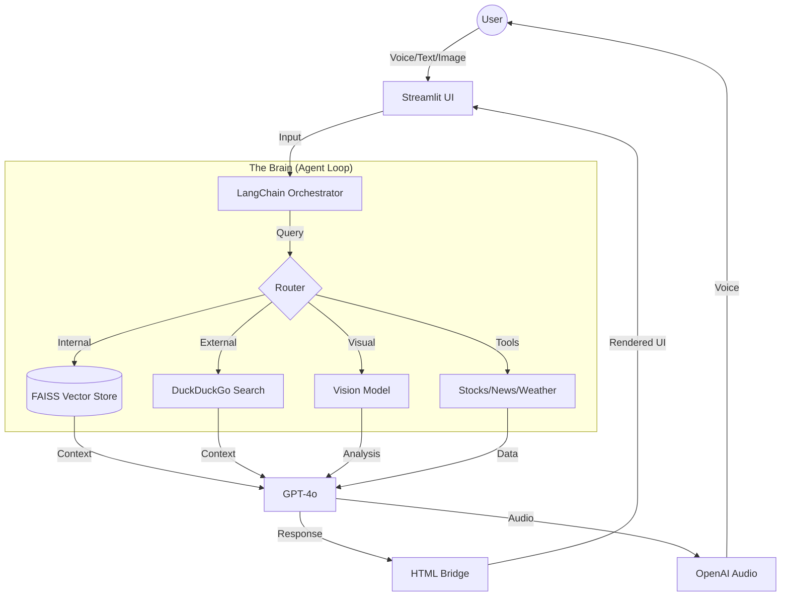

# ✨ EchoMindAI: Enterprise Intelligence

> **The Advanced RAG System with Vision, Voice, and Real-Time Agentic Capabilities.**

<div align="center">

[](https://github.com/Sur27codes/EchoMindAI)
[](https://www.python.org/)
[](https://streamlit.io/)
[](https://openai.com/)
[](LICENSE)


</div>

---

## 📌 Context & Problem Statement

In the modern enterprise, data is everywhere but often inaccessible. Traditional **Retrieval-Augmented Generation (RAG)** systems are powerful but limited: they can "read" text but are blind to images, deaf to voice, and disconnected from the real-time web.

**The Problem:**
Most internal tools are clunky, text-only, and rigid. Users want the fluidity of consumer apps (like ChatGPT) but with the security and depth of enterprise data tools.

**The Goal:**
Build an **"Enterprise Intelligence"** assistant that bridges this gap. A system that can:
1.  **"Read"** private data (PDFs, CSVs).
2.  **"See"** the real world (Images, Charts).
3.  **"Hear"** voice commands (Hands-free).
4.  **"Act"** on live information (Web Search, APIs).
5.  **"Feel"** Premium (Glassmorphism, Animations).

---

## 💡 The Solution: Multi-Modal Agentic Intelligence

EchoMindAI is not just a chatbot; it's a **Multi-Modal Agent**. It intelligently routes queries between its internal knowledge base and external live tools.

### 🌟 Core Capabilities

| Feature | Description |
| :--- | :--- |
| **🧠 The Super-Brain** | A hybrid engine that uses **FAISS** for fast internal document retrieval. If the answer isn't found locally, it seamlessly falls back to **DuckDuckGo** for live web search, ensuring a 0% "I don't know" rate. |
| **👁️ Visual Intelligence** | Upload *any* image. The system uses vision models to identify products for shopping, recognize landmarks for travel, or interpret complex financial charts. |
| **🎤 Voice-First** | Powered by **Groq Whisper**, the system transcribes speech in near real-time (<300ms) and responds with **OpenAI Audio**, creating a fluid voice conversation. |
| **🌐 Live Agent Tools** | The agent performs autonomous research. It can fetch **Stock Prices**, **Global News**, **Weather Forecasts**, and even find **Flight/Hotel Bookings** in real-time. |

---

## 🔮 The "Magic": Technical Innovations

To achieve a "Consumer-Grade" experience on an "Enterprise" stack, we had to innovate beyond standard libraries.

### 1. The "React-Like" UI Engine (Streamlit Hacks)
Streamlit is great for prototypes but lacks visual polish. We pushed it to its absolute limit:
-   **CSS Injection**: We use a custom `styles.py` module to inject CSS that overrides Streamlit's default flat design with **Glassmorphism**, **Neon Gradients**, and **60FPS Particle Backgrounds**.
-   **JavaScript Bridge**: We inject vanilla JavaScript to handle client-side events, enabling "Slide Up" animations and interactive elements that Python alone cannot control.

### 2. The HTML Parsing Bridge
LLMs are unpredictable. They often wrap HTML output in Markdown code blocks (e.g., ` ```html `), which renders as raw code in the chat.
-   **Solution**: We built a robust **Stream Parser** (`parse_mixed_content`). It intercepts the LLM's token stream, identifies these wrappers, strips them instantly, and forces the browser to render the raw HTML.
-   **Result**: Beautiful, interactive **Product Cards**, **Stock Tickers**, and **News Grids** appear directly in the chat, not as code.

### 3. Dynamic Data Visualization Protocol
The agent can decide to visualize data. It outputs a hidden JSON signature (`<!-- CHART_TOOL_JSON: ... -->`). The frontend detects this signature and instantly renders an interactive **Plotly** chart, creating a dynamic analyst experience.

---

## 🏗️ System Architecture



### Tech Stack

| Component | Technology | Role |
| :--- | :--- | :--- |
| **Frontend** | **Streamlit** | Core UI Framework |
| **Styling** | **CSS/JS Injection** | Glassmorphism & Animations |
| **Orchestration** | **LangChain** | Agent Logic & Tool Binding |
| **Intelligence** | **OpenAI GPT-4o** | Reasoning & Generation |
| **Voice (STT)** | **Groq Whisper** | Ultra-Fast Speech-to-Text |
| **Voice (TTS)** | **OpenAI Audio** | Life-like Text-to-Speech |
| **Memory** | **FAISS** | Vector Database for RAG |
| **Search** | **DuckDuckGo** | Live Web Retrieval |

---

## 🚧 Challenges & Solutions

### 1. Latency in Voice & Search
**Challenge**: Chaining Voice -> STT -> Agent -> Web Search -> TTS created a noticeable delay (3-5s).
**Solution**: We migrated STT to **Groq's LPU (Language Processing Unit)**, reducing transcription time to milliseconds. We also implemented an **in-memory response cache** for frequent queries to bypass the LLM entirely.

### 2. Controlling LLM Output
**Challenge**: The LLM would frequently break strict JSON schemas needed for UI rendering.
**Solution**: We implemented a **Robust Error Handler** in the agent loop. Instead of crashing on a JSON error, it "salvages" the raw text from the exception, often ensuring the user still gets a helpful answer even if the UI widget fails.

### 3. Streamlit's Re-run Cycle
**Challenge**: Streamlit re-runs the entire script on every interaction, making persistent state (like chat history or agent memory) difficult.
**Solution**: We heavily utilized `st.session_state` to decouple the Agent's memory from the UI refresh cycle, ensuring a smooth, continuous conversation.

---

## 💥 Impact & Key Learnings

-   **UX is the Differentiator**: The underlying RAG logic is standard, but the **"Magic"**—the instant voice response, the visual product cards, and the beautiful charts—is what makes the tool valuable.
-   **Hybrid is Hard but Worth It**: Balancing the speed of local search with the vastness of the web requires complex routing logic, but it creates a "Super Expert" feel that purely local or purely web agents lack.
-   **Hack the Frame**: Don't be limited by your framework. By injecting custom CSS/JS into Streamlit, we turned a prototyping tool into a production-grade experience.

---

## 📸 Gallery

<div align="center">

### Visual Intelligence
*Identifying and shopping for products from a simple image.*


### Live Agent Tools
*Real-time news fetching with rich media cards.*


</div>

---

## 🚀 Installation & Usage

### 1. Clone the Repository
```bash
git clone https://github.com/Sur27codes/EchoMindAI.git
cd EchoMindAI
```

### 2. Install Dependencies
```bash
pip install -r requirements.txt
```

### 3. Configure Secrets
Create a `.env` file in the root directory:
```env
OPENAI_API_KEY=sk-your-openai-key
GROQ_API_KEY=gsk-your-groq-key
```

### 4. Run the App
```bash
streamlit run streamlit_app.py
```
