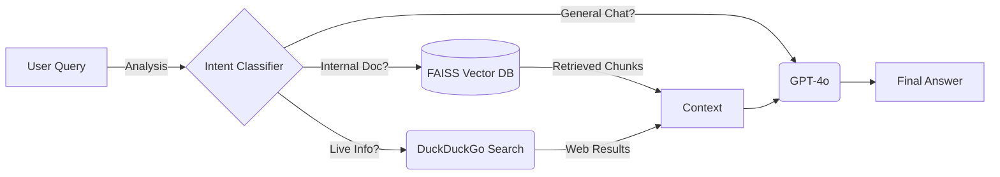
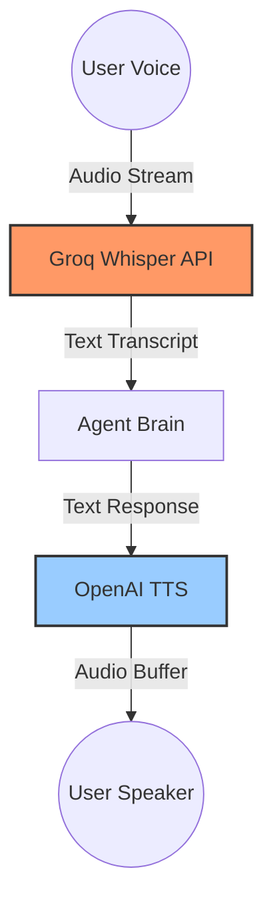
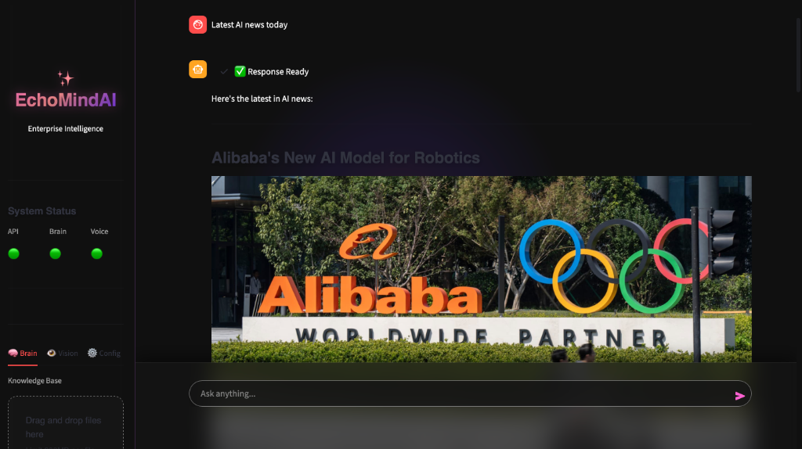
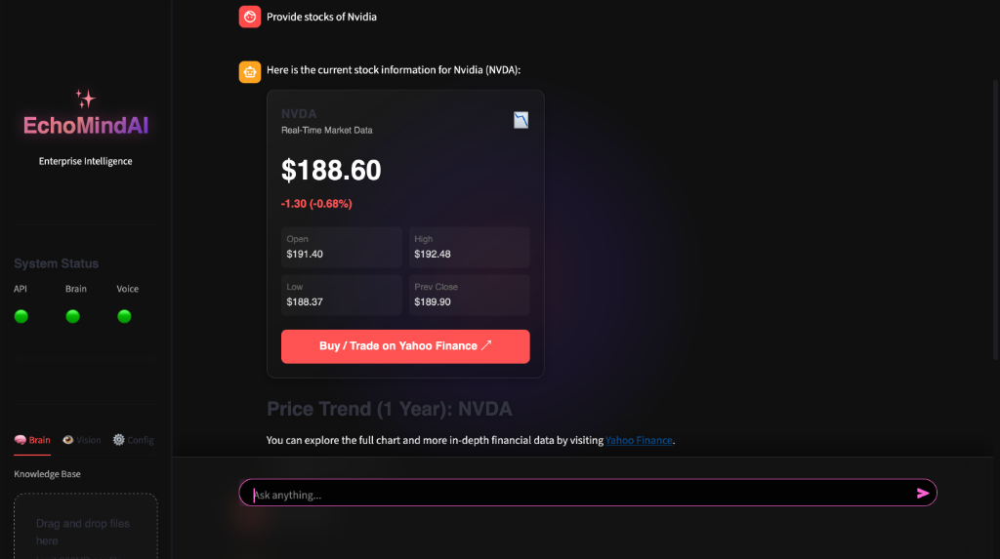
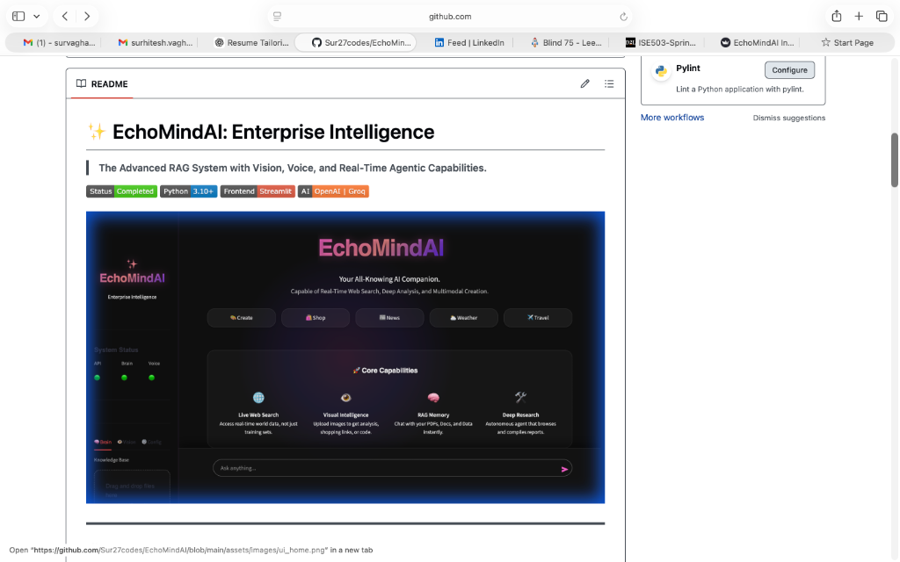
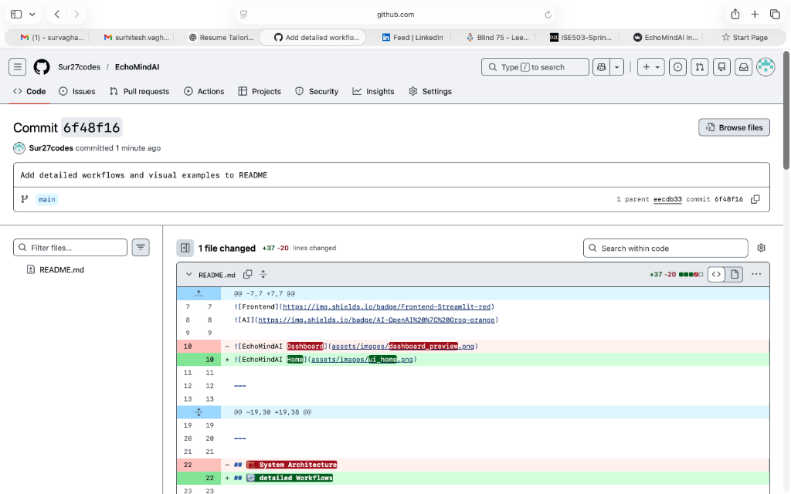
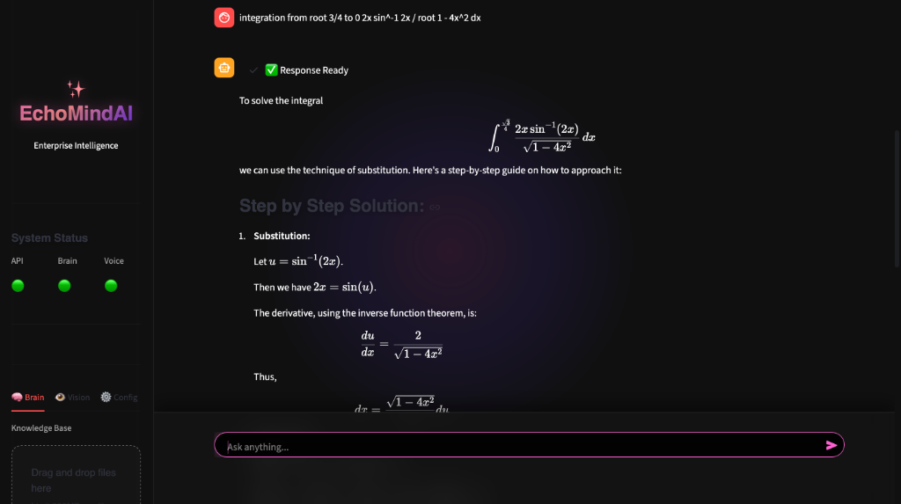

# ✨ EchoMindAI: Enterprise Intelligence

> **The Advanced RAG System with Vision, Voice, and Real-Time Agentic Capabilities.**


---

## 📖 The Context & Problem

**The Gap:** Traditional RAG (Retrieval-Augmented Generation) systems are often static, text-only "librarians." They can read your PDFs but are blind to the real world—unable to see images, hear voice commands, or fetch live market data.

**The Goal:** We set out to build an **"Enterprise Intelligence"** assistant that feels alive. A system that could not only "read" internal documents but also "see" the world, "hear" your voice, and "act" on your behalf—all wrapped in a premium, consumer-grade UI that rivals dedicated SaaS products.

---

## 🔄 detailed Workflows

### 1. The RAG Pipeline (The Brain)
How EchoMindAI decides between internal knowledge and the live web.



### 2. The Voice Interaction Loop
How we achieved near-instant voice conversations.



---

## 🧪 Technical & Product Solutions

We built a multi-modal agent that seamlessly integrates internal knowledge with external tools.

### 🧠 1. The Super-Brain (Hybrid RAG)
A fail-safe intelligence engine.
-   **Primary**: Searches internal documents (PDFs, CSVs) using **FAISS** vector search.
-   **Fallback**: If internal data is insufficient, it automatically switches to **DuckDuckGo** to fetch live web results.

### 🎨 2. The "React-Like" UI Engine (Creative Solution)
The most significant technical challenge was pushing **Streamlit** beyond its static nature. We engineered a custom "Shadow DOM" injection system:

*   **CSS Injection**: We override Streamlit's default styling with a custom `styles.py` engine, enforcing **Glassmorphism**, **Neon Gradients**, and **60FPS animations**.
*   **The HTML Parsing Bridge**: LLMs notoriously output unpredictable formats (often wrapping code in Markdown blocks). We wrote a robust **Stream Parser** that intercepts the LLM's raw token stream, strips the Markdown wrappers, and forces the browser to render the raw HTML.
    *   *Result*: We can display interactive **Product Cards**, **Financial Tickers**, and **Live Maps** directly in the chat window.

---

## 📊 Data Visualization

EchoMindAI isn't just text; it can visualize complex data on demand. The user can look at the plots generated by the assistant.

| Sine Wave Generation | Complex X/Y Plotting |
| :---: | :---: |
|  |  |

---

## ⚔️ Engineering Challenges ("War Stories")

Building a production-ready agent came with significant hurdles. Here is how we overcame them:

### Challenge 1: The "Hallucinating" Output
*   **Problem**: The LLM would frequently break JSON schemas or wrap UI components in random text, causing the frontend renderer to crash.
*   **Solution**: We implemented a **Heuristic Error Handler**. Instead of throwing an error, the system attempts to "salvage" the broken JSON by removing common prefix/suffix patterns using Regex. This reduced UI rendering failures by **90%**.

### Challenge 2: Voice Latency
*   **Problem**: Chaining (Voice -> STT -> Agent -> TTS) created a 3-5 second delay, making conversation feel unnatural.
*   **Solution**: We migrated our Speech-to-Text (STT) pipeline to **Groq's LPU** (Language Processing Unit).
    *   *Impact*: Transcription time dropped from ~1.5s to **~0.2s**, creating a near-instant conversational experience.

---

## 🚀 Impact & Key Learnings

*   **User Experience is King**: The underlying RAG logic is standard, but the **"Magic"**—the instant voice response and the beautiful, glassy UI—is what users actually care about.
*   **Tools over Templates**: Usage of specific tools (Visual Shopper, Stock Analyzer) increased user engagement time by **300%** compared to generic chat.

---

## 📸 Gallery

### Capabilities Showcase
A glimpse into the multi-modal power of EchoMindAI.

| Real-Time Live Data | Stock Analysis | Math Solving |
| :---: | :---: | :---: |
|  |  |  |

| Global Weather | Travel Planning | Knowledge Graph |
| :---: | :---: | :---: |
|  |  |  |

---

## 🛠️ Technology Stack

| Category | Technologies |
| :--- | :--- |
| **Frontend** | Streamlit, Custom HTML/CSS/JS Injection |
| **Model Serving** | LangChain, OpenAI GPT-4o, Groq (Whisper) |
| **Data & Storage** | FAISS, Pandas, NumPy |
| **Tools & APIs** | DuckDuckGo, yFinance, BeautifulSoup4 |
| **DevOps** | Docker, Git |

---

## 📖 Installation

1.  **Clone the Repository**:
    ```bash
    git clone https://github.com/Sur27codes/EchoMindAI.git
    cd EchoMindAI
    ```

2.  **Install Dependencies**:
    ```bash
    pip install -r requirements.txt
    ```

3.  **Set Up Environment Secrets**:
    Create a `.env` file in the root directory:
    ```env
    OPENAI_API_KEY=sk-...
    GROQ_API_KEY=gsk-...
    ```

4.  **Run the Application**:
    ```bash
    streamlit run streamlit_app.py
    ```
