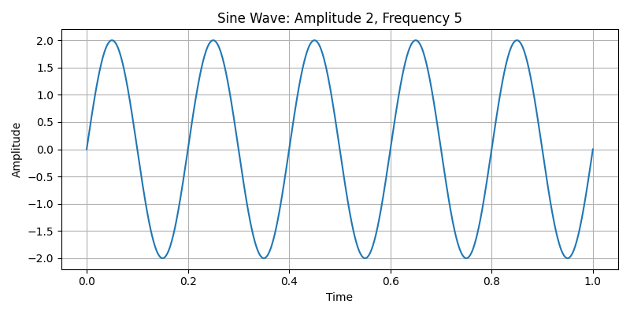
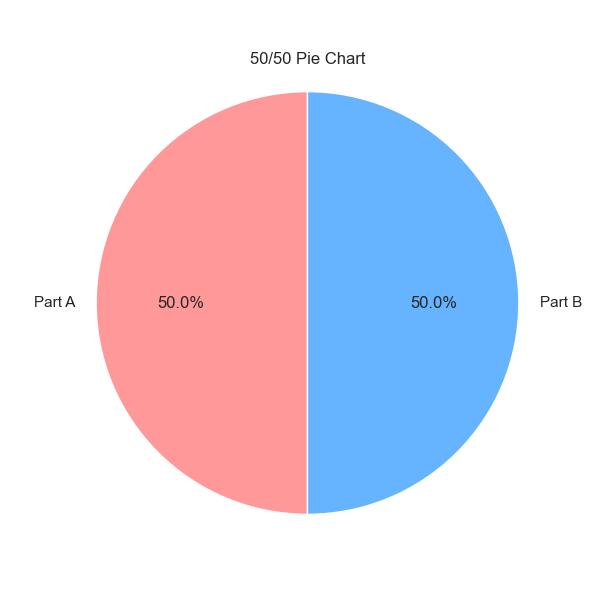
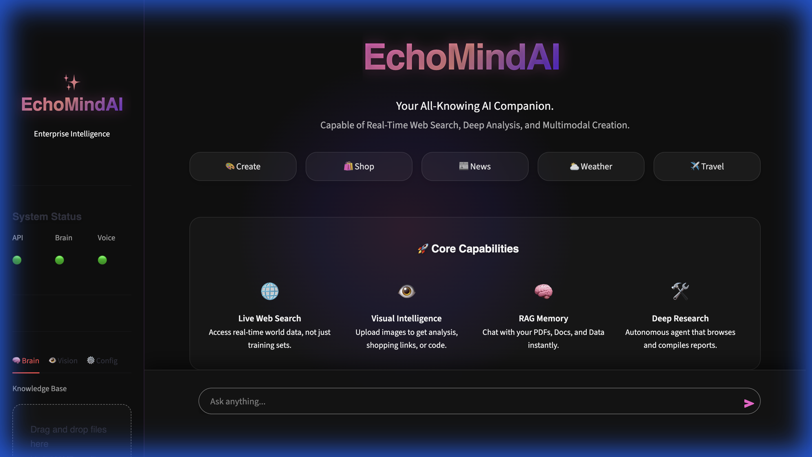

# ✨ EchoMindAI: Enterprise Intelligence

> **The Advanced RAG System with Vision, Voice, and Real-Time Agentic Capabilities.**

EchoMindAI is a next-generation AI assistant that goes beyond simple text. It combines **Retrieval-Augmented Generation (RAG)** with a powerful **Agentic Loop**, allowing it to see images, hear your voice, browse the live web, and render beautiful, interactive UIs.

---

## 🚀 Key Capabilities

### 🧠 1. The Super-Brain (RAG + Agents)
- **Smart Ingestion**: Drag & drop PDFs, Text, Markdown, or CSV files. The system "reads" them and builds a semantic vector index (FAISS).
- **Hybrid Search**: Combines your private document knowledge with live internet search.
- **Fail-Safe Intelligence**: If live search fails, the agent falls back to internal knowledge to generate answers, ensuring you never get a "I don't know" error for common queries.

### 👁️ 2. Visual Intelligence
- **Universal Vision**: Upload *any* image.
    - **Shopping**: Identifies products and builds a price comparison grid.
    - **Travel**: Recognizes landmarks and provides travel guides/hotels.
    - **Data**: Reads charts and graphs.
- **Lightbox UI**: All generated images support click-to-zoom interactivity.

### 🎤 3. Voice Intelligence
- **Hearing (STT)**: Uses **Groq Whisper** for extremely fast, multi-lingual voice transcription.
- **Speaking (TTS)**: Responds with high-quality, life-like AI voices using **OpenAI Audio** (with fallback to gTTS).

### 🌐 4. Live Agent Tools
The system is equipped with a suite of real-time tools:
- **Hotels & Flights**: Finds live booking options, prices, and ratings.
- **Shopping**: Scours the web for the best product deals.
- **News**: Fetches the latest global headlines with images.
- **Weather**: Real-time forecasts.
- **Maps**: Generates Google Maps links for locations.

---

## 🎨 The "React-Like" UI Engine

EchoMindAI pushes **Streamlit** to its absolute limit, tricking it into behaving like a modern React application.

### How it Works:
1.  **CSS Injection**: We inject a custom CSS engine (`styles.py`) that overrides default Streamlit styles with **Glassmorphism**, **Neon Gradients**, and **60FPS Particle Backgrounds**.
2.  **JavaScript Bridge**: We inject vanilla JavaScript to handle client-side events:
    - **IntersectionObserver**: Detects when elements enter the screen to trigger "Slide Up" animations (Scrollytelling).
    - **Lightbox Overlay**: Creates a modal layer for zooming images.
3.  **HTML Wrapping Fix**: We patched the frontend (`streamlit_app.py`) to intercept the LLM's Markdown output. If the LLM wraps HTML in code blocks (` ```html `), our patch strips them instantly, forcing the browser to render the raw HTML as interactive **Product Cards** and **Grids**.

---

## 🛠️ Technology Stack

- **Frontend**: Streamlit (Python) + Custom HTML/CSS/JS Injection.
- **LLM Orchestration**: LangChain + OpenAI GPT-4o.
- **Vector Database**: FAISS (Facebook AI Similarity Search).
- **Search Engine**: DuckDuckGo (via Custom Tools).
- **Voice Stack**: Groq (STT) + OpenAI (TTS).
- **Server**: MCP (Model Context Protocol) Server implementation for modular tools.

---

## 📖 Installation

1.  **Clone & Install**:
    ```bash
    git clone ...
    cd project-x
    pip install -r requirements.txt
    ```

2.  **Environment Secrets**:
    Create a `.env` file:
    ```env
    OPENAI_API_KEY=sk-...
    GROQ_API_KEY=gsk-...
    ```

3.  **Run**:
    ```bash
    streamlit run streamlit_app.py
    ```

---

## 🧪 Advanced Usage

- **Deep Research Mode**: Toggle this in the sidebar to enable a persistent research agent that performs multi-step web investigations.
- **Visual Shopper**: Upload an image of a shoe, watch, or gadget to instantly find where to buy it.

---

## 📸 Gallery

| Data Visualization | Plotting Capabilities | Generated Insights |
|:---:|:---:|:---:|
|  |  |  |

## 🖥️ UI Preview



