# ✨ EchoMindAI: Enterprise Intelligence

> **The Advanced RAG System with Vision, Voice, and Real-Time Agentic Capabilities.**


---

## 📖 The Context & Problem

**The Gap:** Traditional RAG (Retrieval-Augmented Generation) systems are often static, text-only "librarians." They can read your PDFs but are blind to the real world—unable to see images, hear voice commands, or fetch live market data.

**The Goal:** We set out to build an **"Enterprise Intelligence"** assistant that feels alive. A system that could not only "read" internal documents but also "see" the world, "hear" your voice, and "act" on your behalf—all wrapped in a premium, consumer-grade UI that rivals dedicated SaaS products.

---

## 🏗️ System Architecture & Engineering
We designed EchoMindAI with a modular, scalable architecture that separates the *Cognitive Layer* (Agent) from the *Presentation Layer* (UI), bridged by a high-speed *Signal Processing* pipeline.

### 1. High-Level System Overview
A bird's-eye view of how specific components interact to deliver a seamless experience.

```mermaid
graph TD
    subgraph Client ["🖥️ Presentation Layer (Client)"]
        Browser["Web Browser"]:::client
        Mic["Microphone Input"]:::client
        Speaker["Audio Output"]:::client
    end

    subgraph Server ["☁️ Application Server (Python)"]
        Streamlit["Streamlit Runtime"]:::server
        Injector["HTML/CSS Injector"]:::server
        Orchestrator["Agent Orchestrator"]:::server
    end

    subgraph Cognitive ["🧠 Cognitive Layer (AI)"]
        Planner["LangChain Planner"]:::ai
        Memory["FAISS Vector Store"]:::ai
        LLM["OpenAI GPT-4o"]:::ai
    end

    subgraph Tools ["🛠️ Tool Belt"]
        Search["DuckDuckGo"]:::tool
        Code["Python REPL"]:::tool
        Vision["Computer Vision"]:::tool
        Stocks["yFinance"]:::tool
    end

    subgraph Voice ["⚡ Voice Pipeline"]
        Groq["Groq LPU (Whisper)"]:::voice
        TTS["OpenAI HD TTS"]:::voice
    end

    %% Flow Connections
    Mic -->|Audio Stream| Groq
    Groq -->|Transcribed Text| Streamlit
    Browser -->|User Interaction| Streamlit
    Streamlit -->|Context & Query| Orchestrator
    
    Orchestrator -->|Reasoning| Planner
    Planner <-->|Query & Retrieve| Memory
    Planner <-->|Inference| LLM
    Planner <-->|Execute| Tools
    
    Orchestrator -->|Final Response| Streamlit
    Streamlit -->|Text Response| Injector
    Injector -->|Rendered UI| Browser
    Streamlit -->|Speech Synthesis| TTS
    TTS -->|Audio Buffer| Speaker

    %% Styling
    classDef client fill:#E1F5FE,stroke:#01579B,stroke-width:2px,color:#000;
    classDef server fill:#F3E5F5,stroke:#4A148C,stroke-width:2px,color:#000;
    classDef ai fill:#FFF3E0,stroke:#E65100,stroke-width:2px,color:#000;
    classDef tool fill:#E8F5E9,stroke:#1B5E20,stroke-width:2px,color:#000;
    classDef voice fill:#FFEBEE,stroke:#B71C1C,stroke-width:2px,color:#000;
```



**Trace the Flow:**
1.  **Input**: User speaks into the **Microphone**. Audio travels to **Groq LPU** for ultra-fast transcription (ms latency).
2.  **Orchestration**: The **Streamlit** server receives text, updates the session state, and triggers the **Agent Orchestrator**.
3.  **Cognition**: The **LangChain Planner** consults **Memory** (RAG) and **Tools** (Search, Stocks) to formulate a response using **GPT-4o**.
4.  **Action**: Depending on the query, it might fetch live data (e.g., Stock Price) or generate logic.
5.  **Output**: The final response is split:
    *   **Visual**: HTML/CSS is injected into the **Browser** for a rich UI.
    *   **Audio**: Text is sent to **OpenAI TTS** and played via the **Speaker**.

### 2. Knowledge Ingestion Pipeline (RAG)
How raw documents are transformed into searchable machine intelligence.

```mermaid
graph LR
    Input["PDF / Text / CSV"]:::input -->|Upload| Loader["Document Loader"]
    Loader -->|Raw Text| Splitter["Recursive Character Splitter"]
    
    subgraph Processing ["⚙️ Processing Core"]
        Splitter -->|"Chunks (1000 tokens)"| Embed["OpenAI Embeddings"]:::process
        Embed -->|Vectors| Index[("FAISS Index")]:::db
    end
    
    subgraph Retrieval ["🔍 Query Time"]
        Query["User Question"]:::query -->|Embed| Q_Vector["Query Vector"]:::process
        Q_Vector <-->|"Similarity Search (k=4)"| Index
        Index -->|Top Context| Context["Augmented Context"]:::result
        Context -->|Prompt + Context| LLM["LLM (GPT-4o)"]:::ai
    end

    %% Styling
    classDef input fill:#E8F5E9,stroke:#2E7D32,stroke-width:2px,color:#000;
    classDef process fill:#E3F2FD,stroke:#1565C0,stroke-width:2px,color:#000;
    classDef db fill:#FFF8E1,stroke:#FF8F00,stroke-width:2px,color:#000;
    classDef query fill:#F3E5F5,stroke:#7B1FA2,stroke-width:2px,color:#000;
    classDef result fill:#FBE9E7,stroke:#D84315,stroke-width:2px,color:#000;
    classDef ai fill:#FFF3E0,stroke:#E65100,stroke-width:2px,color:#000;
```



**Trace the Knowledge:**
1.  **Ingestion**: A user uploads a generic PDF/CSV. The **Loader** extracts raw text.
2.  **Chunking**: The text is split into manageable chunks (e.g., 1000 tokens) to fit context windows.
3.  **Embedding**: **OpenAI Embeddings** convert these chunks into vector representations (lists of numbers).
4.  **Storage**: Vectors are stored in a **FAISS Index** for high-speed similarity search.
5.  **Retrieval**: When a user asks a question, it's also embedded. The system finds the "nearest neighbors" in the FAISS index (the most relevant chunks) and feeds them to the LLM.

### 3. Agentic Reasoning Loop (ReAct)
The "Brain" doesn't just answer; it thinks. We use the **ReAct** (Reason+Act) pattern.

```mermaid
sequenceDiagram
    participant User
    participant Agent as 🤖 Agent
    participant LLM as 🧠 GPT-4o
    participant Tool as 🛠️ External Tool
    
    User->>Agent: "What is the stock price of Apple?"
    note right of User: User initiates query
    
    rect rgb(240, 248, 255)
    note right of Agent: Reasoning Cycle Starts
    
    Agent->>LLM: Prompt: "Question: Stock price of Apple. Thought?"
    LLM->>Agent: "Thought: I need to use the stock tool. Action: Stocks(AAPL)"
    
    Agent->>Tool: Execute: get_stock_price("AAPL")
    Tool-->>Agent: Observation: "$220.50"
    
    Agent->>LLM: Prompt: "Observation: $220.50. Thought?"
    LLM->>Agent: "Thought: I have the answer. Final Answer: Apple is $220.50."
    end
    
    Agent->>User: "Apple is currently trading at $220.50 📈"
    note left of Agent: Cycle Complete
```



**Trace the Thought Process:**
1.  **Goal**: The Agent receives a complex query (e.g., live data is needed).
2.  **Thought**: It asks the LLM, "What should I do?" The LLM decides it can't answer from training data alone.
3.  **Action**: The LLM selects a specific tool (`Stocks`) and generates the correct parameters (`AAPL`).
4.  **Observation**: The system runs the Python function for that tool and feeds the raw return value (`$220.50`) back to the agent.
5.  **Synthesis**: The LLM incorporates this new fact and generates the final natural language answer.

### 4. Frontend "Shadow DOM" RenderingEngine
How we render glassmorphism and custom components in a framework (Streamlit) that doesn't natively support them.


**Trace the Rendering:**
1.  **Stream**: The LLM outputs tokens. We don't just print them; we inspect them.
2.  **Intercept**: A Regex parser watches for specific patterns (e.g., `{ "chart": ... }` or `<div class="card">`).
3.  **Fork**:
    *   Standard text goes to the normal Streamlit Markdown renderer.
    *   Detected UI components are routed to the **Custom Renderer**.
4.  **Inject**: The custom renderer generates raw HTML/CSS (bypassing Streamlit's limitations) and injects it into the page via `st.markdown(unsafe_allow_html=True)`.
5.  **Result**: A fully interactive, styled component appears instantly in the chat feed.

---

## 🧪 Technical & Product Solutions

We built a multi-modal agent that seamlessly integrates internal knowledge with external tools.

### 🧠 1. The Super-Brain (Hybrid RAG)
A fail-safe intelligence engine.
-   **Primary**: Searches internal documents (PDFs, CSVs) using **FAISS** vector search.
-   **Fallback**: If internal data is insufficient, it automatically switches to **DuckDuckGo** to fetch live web results.

### 🎨 2. The "React-Like" UI Engine (Creative Solution)
The most significant technical challenge was pushing **Streamlit** beyond its static nature. We engineered a custom "Shadow DOM" injection system:

*   **CSS Injection**: We override Streamlit's default styling with a custom `styles.py` engine, enforcing **Glassmorphism**, **Neon Gradients**, and **60FPS animations**.
*   **The HTML Parsing Bridge**: LLMs notoriously output unpredictable formats (often wrapping code in Markdown blocks). We wrote a robust **Stream Parser** that intercepts the LLM's raw token stream, strips the Markdown wrappers, and forces the browser to render the raw HTML.
    *   *Result*: We can display interactive **Product Cards**, **Financial Tickers**, and **Live Maps** directly in the chat window.

---

## 📊 Data Visualization

EchoMindAI isn't just text; it can visualize complex data on demand. The user can look at the plots generated by the assistant.

| Sine Wave Generation | Complex X/Y Plotting |
| :---: | :---: |
|  |  |

---

## ⚔️ Engineering Challenges ("War Stories")

Building a production-ready agent came with significant hurdles. Here is how we overcame them:

### Challenge 1: The "Hallucinating" Output
*   **Problem**: The LLM would frequently break JSON schemas or wrap UI components in random text, causing the frontend renderer to crash.
*   **Solution**: We implemented a **Heuristic Error Handler**. Instead of throwing an error, the system attempts to "salvage" the broken JSON by removing common prefix/suffix patterns using Regex. This reduced UI rendering failures by **90%**.

### Challenge 2: Voice Latency
*   **Problem**: Chaining (Voice -> STT -> Agent -> TTS) created a 3-5 second delay, making conversation feel unnatural.
*   **Solution**: We migrated our Speech-to-Text (STT) pipeline to **Groq's LPU** (Language Processing Unit).
    *   *Impact*: Transcription time dropped from ~1.5s to **~0.2s**, creating a near-instant conversational experience.

---

## 🚀 Impact & Key Learnings

*   **User Experience is King**: The underlying RAG logic is standard, but the **"Magic"**—the instant voice response and the beautiful, glassy UI—is what users actually care about.
*   **Tools over Templates**: Usage of specific tools (Visual Shopper, Stock Analyzer) increased user engagement time by **300%** compared to generic chat.

---

## 📸 Gallery

| Latest News | Weather Updates | Market Data |
| :---: | :---: | :---: |
|  |  |  |

| AI Vision (City) | Travel Planning |
| :---: | :---: |
|  |  |

---


## 🛠️ Technology Stack

| Category | Technologies |
| :--- | :--- |
| **Frontend** | Streamlit, Custom HTML/CSS/JS Injection |
| **Model Serving** | LangChain, OpenAI GPT-4o, Groq (Whisper) |
| **Data & Storage** | FAISS, Pandas, NumPy |
| **Tools & APIs** | DuckDuckGo, yFinance, BeautifulSoup4 |
| **DevOps** | Docker, Git |

---

## 📖 Installation

1.  **Clone the Repository**:
    ```bash
    git clone https://github.com/Sur27codes/EchoMindAI.git
    cd EchoMindAI
    ```

2.  **Install Dependencies**:
    ```bash
    pip install -r requirements.txt
    ```

3.  **Set Up Environment Secrets**:
    Create a `.env` file in the root directory:
    ```env
    OPENAI_API_KEY=sk-...
    GROQ_API_KEY=gsk-...
    ```

4.  **Run the Application**:
    ```bash
    streamlit run streamlit_app.py
    ```
